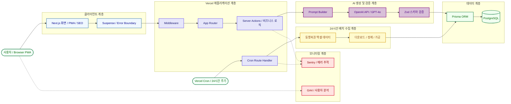

<h1 align="center">
  AI를 활용한 로또 및 연금복권 번호 생성 서비스
</h1>
  
<h2 align="center">
  
  <br>
  <br>
</h2>

<h3 align="center">• 배포 URL: <a href="http://www.cloverpick.com/" target="_blank">https://www.cloverpick.com</a></h3>

<br>

## 📌 프로젝트 소개
- **운영 지표: GA4 기준 누적 활성 사용자 수(AU) 387명 기록 (2026.08 기준)**
- **개발 형태**: 1인 프로젝트로 기획, UI/UX 디자인, 프론트엔드/백엔드 개발, 배포 및 운영까지 전 과정 직접 수행
- **핵심 기능**: 매일 동행복권의 최신 당첨 번호 데이터를 자동 수집 및 정제하여 데이터베이스에 저장하고, 이를 기반으로 OpenAI 모델을 활용한 복권 번호 조합 생성 기능 제공
- **로드맵**: 유저 리텐션 향상을 위한 당첨금 실수령액 계산기, 시각화된 당첨 통계, LLM 기반 대화형 분석 기능 개발 중
  
<br>

## 🛠️ 주요 기능 및 기술적 접근
- **UX/UI 및 PWA**: `Next.js`, `TypeScript`, `Tailwind CSS`를 기반으로 반응형 UI와 다크 모드를 구현하고, `PWA` 설정을 통해 모바일 환경에서도 앱과 유사한 사용자 경험을 제공
- **SEO 및 인터랙션 애니메이션**: `SSR` 적용과 메타데이터 최적화를 통해 검색 엔진 노출을 고려했으며, `Three.js(R3F`)와 `Framer Motion`을 활용해 메인 페이지의 3D 인터랙션과 애니메이션을 구현
- **데이터 페칭 및 상태 관리**: `TanStack(React) Query`와 `Next.js Server Action`을 함께 활용해 서버 데이터 요청 흐름을 구성하고, `React Suspense`를 적용해 로딩 상태를 선언적으로 관리
- **AI 응답 구조화 및 검증**: `LLM(OpenAI)`의 응답을 `generateObject`와 `Zod` 스키마로 검증하여, 번호 개수와 범위가 맞지 않는 비정상 응답(파싱 오류, 할루시네이션)의 형식 오류 방지
- **에러 핸들링 및 모니터링**: `React Error Boundary`를 통해 런타임 에러를 선언적으로 처리하고, `Sentry`와 연동해 프로덕션 환경에서 발생하는 오류를 추적할 수 있도록 환경 구성
- **데이터베이스 관리**: `PostgreSQL`과 `Prisma ORM`를 활용해 생성된 번호 데이터를 저장하고, 타입 안정성을 유지하며 데이터 조회 및 관리 로직을 구성
  
<br>

## ⚙️ 개발 내용
### 1. 개발 기간: 2024.05 ~ 현재 진행 중

### 2. 기술 스택
| 구분 | 기술 |
| --- | --- |
| 코어 | `Next.js`, `TypeScript` |
| 상태 관리 및 데이터 페칭 | `TanStack Query(React Query)`, `Server Action` |
| 비동기 UI 처리 | `React Suspense`, `React Error Boundary` |
| 스타일링 및 애니메이션 | `Tailwind CSS`, `Framer Motion` |
| 3D 그래픽 | `Three.js(R3F)` |
| 패키지 매니저 | `Bun` |
| 빌드 도구 | `SWC` |
| 데이터베이스 및 ORM | `PostgreSQL`, `Prisma ORM` |
| 배포 | `Vercel` |
| 에러 추적 및 분석 | `Sentry`, `GA4` |
| AI API | `OpenAI API` |
| 기타 | `PWA`, `SEO` |
    
### 3. 브랜치 전략
  - Git Flow 전략을 기반으로 `main`, `develop` 브랜치 운용
  - 기능 개발은 `develop` 브랜치에서 진행하며, 테스트 후 `main` 브랜치로 병합하여 배포

### 4. 아키텍처

#### 4-1. 아키텍처 설명
- Vercel Cron Job을 활용해 24시간 주기로 동행복권 데이터를 자동 수집하고 DB에 적재했습니다.
- OpenAI API 응답은 Zod 스키마 검증을 통해 번호 범위, 개수, 응답 구조를 검증한 뒤 사용했습니다.
- Prisma ORM과 PostgreSQL을 활용해 생성 이력과 수집 데이터를 타입 안정성 있게 관리했습니다.
- Sentry와 GA4를 연동해 에러 추적 및 사용자 분석이 가능한 운영 환경을 구성했습니다.

## 🚨 트러블슈팅(troubleshooting)
### 1. 서버리스 환경 제약으로 인한 아키텍처 전환

#### 문제 상황
초기에는 동행복권 데이터를 주기적으로 수집해 DB에 저장하고, Python 기반의 `Pandas`, `TensorFlow LSTM` 모델로 번호 생성 로직을 구성하는 방식을 고려했습니다.
<br>
하지만 Vercel 서버리스 환경에서 직접 모델을 학습하거나 실행하기에는 다음과 같은 제약이 있었습니다.

- TensorFlow 등 고용량 라이브러리로 인한 빌드 및 배포 부담
- 서버리스 함수의 실행 시간 및 리소스 제약
- 별도 학습 서버 운영 시 발생하는 비용 및 운영 복잡도

개인 프로젝트 특성상 비용을 최소화하면서 Vercel 중심의 단일 배포 환경에서 운영 경험을 쌓는 것이 중요했기 때문에, 기존 구조를 그대로 유지하기 어렵다고 판단했습니다.

#### 해결 과정
별도 모델 학습 서버를 운영하는 대신, 데이터 수집 및 DB 적재 흐름은 유지하고 번호 생성 로직을 `OpenAI API` 기반으로 전환했습니다.
<br>
단순히 LLM 응답을 문자열로 받아 사용하는 방식은 JSON 파싱 오류, 형식 불일치, 의도하지 않은 응답이 발생할 수 있다고 판단했습니다.
<br>
이를 방지하기 위해 `generateObject`와 `Zod` 스키마를 함께 적용해 AI 응답을 구조화된 객체로 받고, 런타임에서 응답 형식을 검증하도록 설계했습니다.
```
const { object: data } = await generateObject({
  model: openai("gpt-4o"),
  system: "You're a lotto number prediction system",
  prompt: `Predict ${repeat} sets of 6 winning numbers from 1 to 45`,
  schema: z.object({
    lottoNumbers: z.array(
      z.object({
        numbers: z.array(z.number().min(1).max(45)).length(6),
      }),
    ),
  }),
});
```
예시 응답: data.lottoNumbers[0].numbers -> [3, 12, 17, 26, 31, 41]
<br>
<br>
**구조화된 출력(Structured Outputs)을 채택한 이유**
- **LLM 응답의 객체 구조화**: `generateObject`를 활용해 AI 응답을 UI 렌더링과 DB 저장에 바로 활용 가능한 객체 형태로 변환
- **스키마 기반 응답 검증**: `Zod` 스키마를 통해 번호 범위가 1부터 45 사이인지, 각 조합이 6개의 숫자로 구성되는지 런타임에서 검증
- **파싱 오류 및 비정상 응답 완화**: 일반 텍스트 응답을 직접 파싱하는 방식에서 발생할 수 있는 JSON 형식 오류, 누락 필드, 의도하지 않은 응답 가능성을 줄임

#### 결과
- Vercel 무료 플랜 환경에서도 별도 모델 학습 서버 없이 AI 기반 번호 생성 기능을 운영 가능한 형태로 구현했습니다.
- 이 과정을 통해 단순히 AI API를 호출하는 것에 그치지 않고, 생성형 AI 응답을 실제 서비스 데이터로 안전하게 다루기 위한 구조화, 검증, 저장 흐름까지 함께 설계할 수 있었습니다.
<br>

### 2. SourceMaps 보안 이슈
- Sentry 연동 과정에서 Next.js 빌드 결과물에 SourceMaps 파일이 생성될 수 있음을 확인했습니다.
- SourceMaps가 외부에 노출될 경우 원본 코드 구조나 내부 로직을 추론할 수 있어, 운영 환경에서는 .map 파일이 브라우저에 노출되지 않도록 설정을 적용했습니다.
- 이를 통해 Sentry 기반 에러 추적은 유지하면서도, 클라이언트 번들에서 SourceMaps 접근 가능성을 줄였습니다.

| SourceMaps 비활성화 코드 적용 전 |
|----------|
|  |

| SourceMaps 비활성화 코드 |
|----------|
|  |

| SourceMaps 비활성화 코드 적용 후 |
|----------|
|  |

<br>
<br>

## 📱 페이지별 기능
| 반응형 및 다크 모드(테마 선택) 기능 |
|----------|
|  |

| 3D 애니메이션 및 메인페이지 |
|----------|
|  |

| 로또 번호 생성 및 번호 복사 기능 |
|----------|
|  |

| 연금복권 번호 생성 및 번호 복사 기능 |
|----------|
|  |

<br>
<br>
