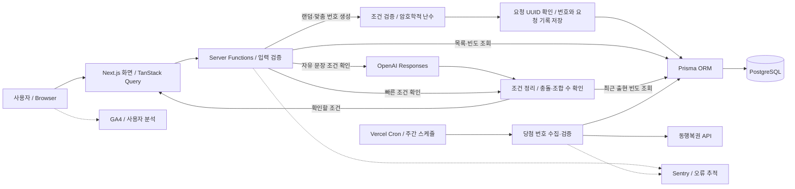

<h1 align="center">
  AI를 활용한 로또 및 연금복권 번호 생성 서비스
</h1>
  
<h2 align="center">
  
  <br>
  <br>
</h2>

<h3 align="center">클로버픽 배포 URL: <a href="http://www.cloverpick.com/" target="_blank">https://www.cloverpick.com</a></h3>

<br>

## 📌 프로젝트 소개

- **운영 지표: GA4 기준 누적 활성 사용자 수(AU) 400명 기록 (2026.09 기준)**
- **개발 형태**: 1인 프로젝트로 기획, UI/UX 디자인, 프론트엔드/백엔드 개발, 배포 및 운영까지 전 과정 직접 수행
- **핵심 기능**: 주 단위(회차 마감 후)로 동행복권의 최신 당첨 번호 데이터를 자동 수집 및 정제하여 데이터베이스에 저장하고, 로또·연금복권의 자연어 조건 해석과 무작위 번호 생성, 로또의 최근 출현 빈도 조건을 제공
- **로드맵**: 유저 리텐션 향상을 위한 당첨금 실수령액 계산기, 시각화된 당첨 통계, LLM 기반 대화형 분석 기능 개발 중

<br>

## 🛠️ 주요 기능 및 기술적 접근

- **반응형 UX/UI**: `Next.js`, `TypeScript`, `Tailwind CSS`를 기반으로 모바일·데스크톱에 대응하는 반응형 UI와 다크 모드를 구현
- **SEO 및 인터랙션 애니메이션**: `SSR` 적용과 메타데이터 최적화를 통해 검색 엔진 노출을 고려했으며, `Three.js(R3F)`와 `Motion for React`을 활용해 메인 페이지의 3D 인터랙션과 애니메이션을 구현
- **데이터 페칭 및 상태 관리**: `TanStack Query(React Query)`와 `Next.js Server Action`을 함께 활용해 서버 데이터 요청 흐름을 구성하고, `React Suspense`를 적용해 로딩 상태를 선언적으로 관리
- **AI 조건 해석과 번호 생성 분리**: `generateText`·`Output.object`·`Zod`로 자연어를 조건으로 정리하고, 사용자가 확인한 조건 안에서 암호학적 난수로 조합을 선택합니다. 게임 수·번호·충돌을 서버에서 검증하며, 요청 UUID로 중복 적재를 방지합니다. [주요 설계](#로또-생성의-주요-설계)을 참고하세요.
- **에러 핸들링 및 모니터링**: `React Error Boundary`를 통해 런타임 에러를 선언적으로 처리하고, `Sentry`와 연동해 프로덕션 환경에서 발생하는 오류를 추적할 수 있도록 환경 구성
- **데이터베이스 관리**: `PostgreSQL`과 `Prisma ORM`를 활용해 생성된 번호 데이터를 저장하고, 타입 안정성을 유지하며 데이터 조회 및 관리 로직을 구성
- **단위 테스트**: 회차 계산, 당첨 등수 판별처럼 정합성이 중요한 순수 함수에 `Vitest` 단위 테스트를 작성해 회귀 발생 가능성을 줄임

<br>

## ⚙️ 개발 내용

### 1. 개발 기간: 2024.05 ~ 현재 진행 중

### 2. 기술 스택

| 구분                     | 기술                                           |
| ------------------------ | ---------------------------------------------- |
| 코어                     | `Next.js`, `TypeScript`                        |
| 상태 관리 및 데이터 페칭 | `TanStack Query(React Query)`, `Server Action` |
| 비동기 UI 처리           | `React Suspense`, `React Error Boundary`       |
| 스타일링 및 애니메이션   | `Tailwind CSS`, `Motion for React`                |
| 3D 그래픽                | `Three.js(R3F)`                                |
| 패키지 매니저            | `Bun`                                          |
| 빌드 도구                | `Turbopack`                                          |
| 테스트                   | `Vitest`                                       |
| 데이터베이스 및 ORM      | `PostgreSQL(Neon)`, `Prisma ORM`               |
| 배포                     | `Vercel`                                       |
| 에러 추적 및 분석        | `Sentry`, `GA4`                                |
| AI API                   | `OpenAI API`                                   |
| 기타                     | `SEO`                                   |

### 3. 브랜치 전략

- Git Flow 전략을 기반으로 `main`, `develop` 브랜치 운용
- 기능 개발은 `develop` 브랜치에서 진행하며, 테스트 후 `main` 브랜치로 병합하여 배포

### 4. 아키텍처



#### 4-1. 아키텍처 설명

- Vercel Cron Job을 활용해 주 단위(회차 마감 후)로 동행복권 데이터를 자동 수집하고 DB에 적재했습니다.
- OpenAI는 자연어에서 복권별 조건을 추출합니다. 조건을 확인한 뒤 서버가 조합을 생성하고 요청 기록과 번호를 한 트랜잭션에 저장합니다.
- Prisma ORM과 PostgreSQL을 활용해 생성 이력과 수집 데이터를 타입 안정성 있게 관리했습니다.
- Sentry와 GA4를 연동해 에러 추적 및 사용자 분석이 가능한 운영 환경을 구성했습니다.

## 로또 생성의 주요 설계

- **AI의 역할 제한**: 자유 문장을 번호 조건으로 변환하고 사용자가 확인한 뒤 생성합니다. 실제 번호 선택은 서버의 암호학적 난수로 처리하며, 랜덤 생성과 빠른 조건에는 AI를 호출하지 않습니다. 최대 300자·5게임를 허용하고 충돌하거나 지원하지 않는 조건은 임의로 무시하지 않습니다.
- **통계 기준 명시**: 최근 100회 추첨의 본번호 출현 횟수 상위 20개를 후보로 사용합니다. 보너스 번호는 제외하고 동률은 작은 번호부터 선택합니다. 회차 누락 시 해당 조건을 제공하지 않으며, 당첨확률을 높이는 기능으로 설명하지 않습니다.
- **저장과 재시도**: 요청 UUID·입력 해시로 중복 요청을 구분하고 번호와 요청 기록을 한 트랜잭션에 저장합니다. 응답을 받지 못해 같은 요청을 재시도하면 저장된 결과를 반환합니다. 재시도 식별자는 열린 페이지에서 유지되며 새로고침 후에는 새 요청입니다. 한 번에 생성한 게임끼리는 동일한 조합을 허용하지 않습니다.
- **비용·입력 보호**: AI 호출은 15초로 제한하고 PostgreSQL에서 분당·일일 요청 한도와 서비스 전체 예산을 관리합니다. 원문은 서비스 DB에 저장하지 않으며 화면에 OpenAI 전송을 안내합니다. 입력 내용은 개발 로그와 오류 재현 기록에서도 제외하거나 마스킹합니다. 상세 한도는 [요청 제한 코드](src/server/lottery/lotteryRequestLimit.ts)에서 관리합니다.
- **안정적인 목록 탐색**: 생성 목록과 당첨 내역은 6게임씩 조회합니다. 페이지 탐색 중 새 기록이 추가되어도 항목이 밀리지 않도록 조회 기준을 유지하고, 로딩 중 기존 화면을 보존합니다. 당첨 내역은 생성 시각 대신 해당 회차의 추첨일을 연결합니다.

핵심 구현: [조건 해석](src/server/lottery/parseLottoPrompt.ts) · [조합 생성](src/server/lottery/lottoEngine.ts) · [중복 저장 방지](src/server/lottery/lottoPersistence.ts) · [목록 조회](src/server/lottery/lottoRecords.ts)

## 연금복권720+의 규칙과 공통 처리

- **복권별 규칙 분리**: 1~5조와 순서가 있는 여섯 자리 숫자를 사용하며, 앞자리 0과 반복 숫자를 보존합니다. 조·앞/끝자리·포함/제외 숫자·중복 여부를 조건으로 받고, 같은 번호의 모든 조 생성은 총 5게임으로 검증합니다. 자리별 후보를 세어 암호학적 난수로 고릅니다.
- **당첨 판정**: 오른쪽 끝자리부터 비교하고 보너스가 3~7등과 겹치면 보너스를 적용합니다. 외부 추첨 응답의 번호·날짜·회차 충돌도 저장 전에 검증합니다. [공식 규칙](https://www.dhlottery.co.kr/pt720/intro) · [생성 엔진](src/server/lottery/pensionEngine.ts) · [등수 판정](src/utils/pensionRanking.ts)
- **AI 해석 검증**: `bun run eval:pension`으로 한글 개수·복수 조·앞자리 0·지원하지 않는 조건을 실제 모델에 대조합니다. 로컬 API 키로 소량의 API 호출을 하며 DB에는 접근하지 않습니다. CI는 외부 호출 없는 SDK 계약 테스트만 실행합니다.
- **공통 오류 예방**: 버튼·재시도·탭·페이지네이션은 두 복권이 같은 컴포넌트를 사용합니다. 생성 결과를 유지한 채 개수를 바꾸고, 캐시되지 않은 페이지를 불러올 때도 기존 목록을 유지합니다. 요청 제한은 두 복권 합산이며, 연금복권도 UUID와 트랜잭션으로 중복 저장을 막습니다.

## 로컬 개발 및 품질 검사

- Node.js 22.12 이상(22 LTS 권장)과 Bun 1.2.23을 사용합니다. `bun.lock`을 커밋하고 CI에서도 같은 Bun 버전으로 설치합니다.
- Next.js 16.3.5와 React 19.2.8을 사용합니다. React Three Fiber 9.7의 지원 범위에 맞춰 React 19.3으로 자동 업데이트되지 않도록 고정했습니다.
- React 19 호환성을 위해 Three.js 계열, Motion, next-themes, TanStack Query를 갱신하고 Lottie 플레이어를 `@lottiefiles/dotlottie-react`로 교체했습니다.
- 개발·프로덕션 빌드 모두 Next.js 기본 Turbopack을 사용하며 SVG 컴포넌트는 `turbopack.rules`에서 SVGR로 변환합니다. `svgr.d.ts`에서 SVG 속성 타입을 선언합니다.
- Sentry 10.74와 Turbopack의 기본 소스맵 생성·업로드·클라이언트 소스맵 삭제 동작을 사용합니다. 중복된 수동 삭제 glob은 제거했으며, 서버 소스맵은 런타임 오류 추적을 위해 유지합니다. 업로드에는 빌드 환경의 Sentry 인증 설정이 필요합니다.
- TanStack Query 5.102의 `environmentManager.isServer()`와 `queryClient.query()`를 사용합니다. 사전 조회 실패는 `.catch(noop)`으로 처리해 기존 Suspense·Error Boundary 재시도 흐름을 유지합니다. Next.js 라우트 오류 화면은 16.3의 `retry()`로 데이터를 다시 요청하며, React Context는 19의 Provider 표기를 사용합니다. Motion의 공식 권장 import인 `motion/react`로 갱신했습니다.
- 앱 설치·오프라인 캐시 기능은 종료했습니다. `public/sw.js`는 기존 방문자의 서비스 워커를 종료하고 해당 캐시만 정리하는 파일로 Git에서 관리합니다. 새 방문자에게는 등록하지 않으며, 장기간 후 재방문하는 사용자도 갱신할 수 있도록 같은 URL을 유지합니다. 일반 브라우저 저장소·다크 모드 설정은 삭제하지 않습니다.
- ESLint와 Prettier를 Biome으로 통합했습니다. React·Next.js 규칙, import 정리, 두 칸 들여쓰기·큰따옴표·세미콜론을 적용합니다. Cursor/VS Code에서는 권장 Biome 확장을 설치하면 저장 시 적용됩니다.
- 기존 위치 기반 번호 표시와 스켈레톤의 key 정책은 이번 도구 전환에서 유지하므로 `noArrayIndexKey`는 비활성화했습니다. Tailwind 클래스 정렬은 Biome의 실험적 규칙과 기존 플러그인의 동작이 달라 자동 적용하지 않습니다.
- Prisma CLI·Client·PostgreSQL 드라이버를 정식 7.10.0으로 맞췄습니다. `latest`의 Prisma 8 RC는 적용하지 않았습니다. 생성 코드는 `src/generated/prisma`에 두고 Git에서 제외합니다.
- Prisma CLI는 `prisma.config.ts`의 `POSTGRES_URL_NON_POOLING`, 앱은 `POSTGRES_PRISMA_URL`을 사용합니다. `pg` 어댑터는 인스턴스당 최대 연결 5개, 연결 대기 5초, 유휴 연결 10초로 설정하며 개발 중에는 클라이언트를 재사용합니다. 기존 DB 모델과 데이터는 유지합니다. SSL의 `require` 등 기존 별칭은 `pg` 8과 같은 인증서 검증을 유지하도록 `verify-full`로 명시하며, 원본 환경변수는 바꾸지 않습니다.
- 생성 요청은 서버에서 1~5의 정수만 허용하며 연금복권의 모든 조 옵션은 boolean으로 검증합니다. 연금복권은 1~5조와 6자리 숫자를 유지하고, 모든 조 선택 시 같은 번호의 5개 조합을 생성합니다. 가능한 번호 개수를 먼저 계산하고 중복 없는 순위를 추출하므로 충돌 재시도나 임의의 대체 번호를 사용하지 않습니다. 중복 제한은 한 요청 안에 적용하며 과거 생성 이력과의 중복을 금지하지 않습니다.
- AI SDK 7·OpenAI Provider 4·Zod 4를 사용합니다. 로또·연금복권 자유 문장은 Responses의 구조화 출력으로 해석하며, 기본 모델은 `gpt-5.4-nano-2026-03-17`입니다. 랜덤 생성과 빠른 조건은 AI 호출 없이 처리합니다. `OPENAI_API_KEY`를 설정하며 모델은 `OPENAI_LOTTO_MODEL`로 변경하며 연금복권만 다르게 지정하려면 `OPENAI_PENSION_MODEL`을 사용합니다.
- Tailwind CSS 4의 테마·다크 모드·애니메이션을 `src/app/globals.css`로 옮기고 PostCSS 전용 플러그인을 사용합니다. 지원 브라우저 기준은 Safari 16.4+, Chrome 111+, Firefox 128+입니다. 기존 테두리·그림자·툴팁 및 버튼 커서 표현은 전환 시 보존합니다.
- TypeScript 7.0.2와 Vitest 5를 사용합니다. Next.js 16.3.5의 기본 CLI 타입 검사 경로(`experimental.useTypeScriptCli`)를 사용하며 빌드 오류 검사를 유지합니다. 해당 Next.js 설정은 공식 문서상 experimental입니다. React Error Boundary 6의 `unknown` 오류는 타입을 확인한 뒤 처리합니다.
- Vercel CLI는 개발 의존성으로 이동하고, 사용하지 않는 `@types/minimatch`와 Tailwind 4에서 불필요한 Autoprefixer는 제거했습니다.

화면의 통계·생성 이력 조회에는 PostgreSQL이 필요합니다. 로컬에서는 Docker Desktop을 실행한 뒤 아래 명령을 사용합니다. 기존 `.env`의 운영 DB 주소는 변경하지 않아도 됩니다. `:local` 명령이 자식 프로세스의 DB 주소만 로컬 주소로 대체합니다. API 키는 기존 `.env`에서 읽으며 커밋하지 않습니다.

```sh
bun install --frozen-lockfile --ignore-scripts
bun run db:up
bun run db:prepare:local
bun run dev:local
```

`bun run test:local`은 DB 동시성 테스트까지 실행하며 `bun run build:local`은 로컬 DB로 빌드를 검증합니다. `bun run db:stop`으로 중지해도 데이터는 보존됩니다. 로컬 DB는 [compose.yaml](compose.yaml)로 관리합니다.

```sh
bun run check       # 린트·포맷·import 순서 및 TypeScript 검사
bun run check:fix   # 안전한 자동 수정 후 TypeScript 검사
bun run format     # 포맷 적용
bun run typecheck  # Next.js 타입 생성 및 TypeScript 검사
bun run test       # Vitest 단위 테스트
bun run build:local # 로컬 DB로 Prisma 클라이언트 생성 및 프로덕션 빌드
```

테스트의 `describe`·`it`·`test` 설명과 매개변수별 사례 이름은 한국어로 작성하며, 조건과 기대 결과를 드러냅니다. 함수·API·필드 식별자는 원래 이름을 유지합니다.

회차·등수·입력 검증·저장 실패·인증·기존 캐시 정리처럼 실제 동작과 데이터 보호에 필요한 테스트를 유지합니다. 동일한 입력과 결과를 반복하거나 라이브러리 자체 동작만 재검사하는 사례는 추가하지 않습니다. 일반 테스트에서 외부 API와 DB는 mock으로 대체합니다. 명시한 로컬 테스트 DB에서만 저장·동시성 통합 테스트를 추가로 실행합니다.

[Vitest 5](https://vitest.dev/guide/migration/#clearmocks-is-enabled-by-default)의 기본 `clearMocks: true`로 mock 호출 기록을 초기화합니다. 환경변수·전역 함수·spy의 복원은 자동 초기화와 다르므로 해당 테스트에서 명시적으로 정리합니다. JSON·JUnit·HTML 리포트의 기본 저장 경로인 `.vitest/`는 Git에서 제외합니다.

CI는 별도 PostgreSQL 서비스에 테스트 스키마를 생성한 뒤 빌드합니다. 운영 DB나 외부 API 키를 사용하지 않습니다. 로컬 빌드는 페이지 사전 렌더링 중 DB를 조회하므로 개발용 DB 연결을 먼저 확인합니다.

빈 로컬 DB에는 당첨 번호 자료가 없으므로 출현 빈도 조건을 사용할 수 없습니다. 화면 검증용 합성 데이터는 실제 당첨 통계와 구분합니다.

<details>
<summary>환경변수와 운영 DB 준비</summary>

- `POSTGRES_PRISMA_URL`: 앱의 PostgreSQL 연결
- `POSTGRES_URL_NON_POOLING`: Prisma CLI의 직접 연결
- `OPENAI_API_KEY`: 자연어 조건 확인에 필요한 서버 키
- `OPENAI_LOTTO_MODEL`: 공통 조건 해석 모델 변경 시에만 지정
- `OPENAI_PENSION_MODEL`: 연금복권에 별도 모델을 사용할 때만 지정

로컬 `:local` 명령은 DB 주소를 Docker 주소로 덮어씁니다. 운영 배포 전에는 직접 연결 대상을 확인하고 [로또 SQL](prisma/lotto-generation-setup.sql)·[연금복권 SQL](prisma/pension-generation-setup.sql)로 `lotto_generation_batch`, `pension_generation_batch`, `lottery_request_limit` 세 테이블을 준비합니다. 기존 번호 데이터는 변경하지 않으며 운영 DB에 `prisma db push`나 reset을 사용하지 않습니다.

```sh
bun run db:setup:lotto
bun run db:setup:pension
```

</details>

## 🚨 트러블슈팅(troubleshooting)

### 1. 당첨 번호 수집 중단으로 인한 회차 고정 및 데이터 정합성 문제

#### 문제 상황

로또와 연금복권720+ 번호 생성 화면의 현재 회차가 각각 1205회, 296회로 고정되어 있는 걸 확인했습니다.
<br>
실제 회차(2026.08.14 기준 로또 1237회, 연금복권 329회)와 32~33회차 차이가 있었습니다.

코드를 확인해보니 현재 회차는 날짜 기반이 아니라 당첨 번호 테이블의 최신 `draw_number` + 1로 계산되는 구조였습니다.

```typescript
const lastDrawNumber = await prisma.lotto.findFirst({
  orderBy: { draw_number: "desc" },
  select: { draw_number: true },
});
return { success: { draw_number: lastDrawNumber.draw_number + 1 } };
```

이 방식은 당첨 번호를 매일 수집하는 배치가 정상 동작한다는 전제가 필요했는데, 수집에 사용하던 동행복권 엑셀 다운로드가 2025년 12월 25일부터 응답하지 않게 되면서 배치가 실패하기 시작했습니다.
<br>
Sentry 연동은 되어 있었으나 데이터 수집 오류에 대한 실패 알림이 없어 인지하지 못했습니다.

배치가 실패한 시점의 마지막 회차(로또 1204회, 연금복권 295회) 이후로 회차 값이 갱신되지 않았고, 이 기간 생성된 번호는 마지막 회차 값으로 저장됐습니다.
<br>
당첨 판별 로직 또한 최신 회차와 일치하는 생성 기록만 조회하는 구조라, 이 기간 생성된 번호는 실제 당첨 여부와 무관하게 판별 대상에서 제외되고 있었습니다.

#### 해결 과정

**회차 계산 방식 변경**
<br>
회차를 DB 상태에 의존하지 않도록, 각 상품의 최초 판매 마감 시각을 기준으로 현재까지의 경과 주 수를 계산하는 순수 함수로 전환했습니다.
<br>
로또는 2002.12.07(토) 20:00 KST, 연금복권720+는 2020.05.07(목) 17:00 KST을 앵커 날짜 기준으로 삼았고, 현재 회차는 판매가 아직 마감되지 않은 다음 예정 회차를 의미하도록 정의했습니다.
<br>
이 계산 로직과 당첨 등수 판별 로직(보너스 번호 일치 여부 등 경계 조건 포함)에 Vitest 단위 테스트를 추가했습니다.

**당첨 번호 수집 방식 변경**
<br>
엑셀 다운로드 후 cheerio, iconv-lite로 전체 내용을 분석해 최근 회차를 적재하던 방식에서, 동행복권이 제공하는 최근 회차 조회 API로 수집 방식을 교체했습니다.
<br>
응답받은 회차가 계산상 기대하는 값과 다를 경우 적재하지 않고 실패 처리해 Sentry로 알림이 오도록 구성했습니다.

**데이터 정정**
<br>
정정 대상은 배치 중단 기간 수집되지 않은 당첨 번호 원본 데이터와, 그 기간 잘못된 회차로 저장된 생성 및 당첨 내역 두 가지였습니다.
<br>
백필(Backfill)과 드라이런(Dry-run) 스크립트를 함께 작성해 드라이런으로 변경될 내용을 먼저 콘솔로 확인한 뒤 해당 코드를 커밋했습니다.
<br>
운영 DB에 바로 적용하지 않고 Neon 브랜치로 복제 DB를 만들어 백필 절차를 먼저 검증했고, 이상이 없는 걸 확인한 뒤에 운영 DB에 반영했습니다.

#### 결과

날짜 기반 회차 계산으로 전환한 결과, 회차 표시가 DB 적재 상태와 무관하게 항상 정확한 값을 반환하게 됐습니다.
<br>
수집 응답 검증 로직을 추가한 결과, 이후 동일한 실패가 발생해도 즉시 알림을 받을 수 있게 됐습니다.
<br>
백필과 재계산을 통해 누락된 당첨 번호 원본 데이터 65회차분(로또 32회차, 연금복권 33회차)을 적재하고, 잘못된 회차로 저장된 생성 내역 375건(로또 235건, 연금복권 140건)을 재계산했으며, 회차 오류로 누락됐던 당첨 처리 27건(로또 8건, 연금복권 19건)을 확인해 반영했습니다.

<br>

### 2. 서버리스 환경 제약으로 인한 아키텍처 전환

#### 문제 상황

초기에는 동행복권 데이터를 주기적으로 수집해 DB에 저장하고, Python 기반의 `Pandas`, `TensorFlow LSTM` 모델로 번호 생성 로직을 구성하는 방식을 고려했습니다.
<br>
하지만 개인 프로젝트 특성상 비용을 최소화하면서 Vercel 서버리스 환경에서 직접 모델을 학습하거나 실행하기에는 다음과 같은 제약이 있었습니다.

- TensorFlow 등 고용량 라이브러리로 인한 빌드 및 배포 부담
- 서버리스 함수의 실행 시간 및 리소스 제약
- 별도 학습 서버 운영 시 발생하는 비용 및 운영 복잡도

#### 해결 과정

별도 모델 학습 서버를 운영하는 대신, 데이터 수집 및 DB 적재 흐름은 유지하고 번호 생성 로직을 `OpenAI API` 기반으로 전환했습니다.
<br>
단순히 LLM 응답을 문자열로 받아 사용하는 방식은 JSON 파싱 오류, 형식 불일치, 할루시네이션 응답이 발생할 수 있다고 판단했습니다.
<br>
이를 방지하기 위해 `generateObject`와 `Zod` 스키마를 함께 적용해 AI 응답을 구조화된 객체로 받고, 런타임에서 응답 형식을 검증하도록 설계했습니다.

아래는 초기 구현 예시이며 당첨 예측 성능이 검증되었다는 의미는 아닙니다. 현재는 AI SDK 7의 `generateText`·`Output.object`로 **자연어 조건만 해석**하고, [조건별 조합 생성기](src/server/lottery/lottoEngine.ts)에서 번호를 무작위로 선택합니다. [현재 주요 설계](#로또-생성의-주요-설계)을 참고하세요.

```typescript
const { object: data } = await generateObject({
  model: openai("gpt-4o"),
  system: "You're a lotto number prediction system",
  prompt: `Predict ${repeat} sets of 6 winning numbers from 1 to 45`,
  schema: z.object({
    lottoNumbers: z.array(
      z.object({
        numbers: z.array(z.number().min(1).max(45)).length(6),
      }),
    ),
  }),
});
```

예시 응답: `data.lottoNumbers[0].numbers` -> `[3, 12, 17, 26, 31, 41]`

**구조화된 출력(Structured Outputs)을 채택한 이유**

- **LLM 응답의 객체 구조화**: `generateObject`를 활용해 AI 응답을 UI 렌더링과 DB 저장에 바로 활용 가능한 객체 형태로 변환
- **스키마 기반 응답 검증**: `Zod` 스키마를 통해 번호 범위가 1부터 45 사이인지, 각 조합이 6개의 숫자로 구성되는지 런타임에서 검증
- **파싱 오류 및 할루시네이션 응답 완화**: 일반 텍스트 응답을 직접 파싱하는 방식에서 발생할 수 있는 JSON 형식 오류, 누락 필드, 할루시네이션 응답 가능성을 줄임

#### 결과

- Vercel 무료 플랜 환경에서도 별도 모델 학습 서버 없이 AI 기반 번호 생성 기능을 운영 가능한 형태로 구현했습니다.
- 이 과정을 통해 단순히 AI API를 호출하는 것에 그치지 않고, 생성형 AI 응답을 실제 서비스 데이터로 안전하게 다루기 위한 구조화, 검증, 저장 흐름까지 함께 설계할 수 있었습니다.

<br>

### 3. SourceMaps 보안 이슈

아래 스크린샷은 초기 설정 당시 기록입니다. 현재 Sentry 10.74·Turbopack에서는 [SDK 기본 동작](https://docs.sentry.io/platforms/javascript/guides/nextjs/configuration/build/)으로 소스맵을 생성하고 업로드 후 공개 경로(`.next/static/`)의 소스맵을 삭제합니다. 소스맵 생성을 끄는 방식과는 다르며 서버 소스맵(`.next/server/`)은 보존합니다.

#### 문제 상황
- Sentry 연동 과정에서 Next.js 빌드 결과물에 SourceMaps 파일이 생성될 수 있음을 확인했습니다.
- SourceMaps가 외부에 노출될 경우 원본 코드 구조나 내부 로직을 추론할 수 있어, 운영 환경에서는 .map 파일이 브라우저에 노출되지 않도록 설정을 적용했습니다.
- 이를 통해 Sentry 기반 에러 추적은 유지하면서도, 클라이언트 번들에서 SourceMaps 접근 가능성을 줄였습니다.

| SourceMaps 비활성화 코드 적용 전                                                                                                                 |
| ------------------------------------------------------------------------------------------------------------------------------------------------ |
|  |

#### 해결 과정
| SourceMaps 비활성화 코드                                                                                                                 |
| ---------------------------------------------------------------------------------------------------------------------------------------- |
|  |

#### 결과
| SourceMaps 비활성화 코드 적용 후                                                                                                                 |
| ------------------------------------------------------------------------------------------------------------------------------------------------ |
|  |


<br>

## 📱 페이지별 기능

| 반응형 및 다크 모드(테마 선택) 기능                                                                                                  |
| ------------------------------------------------------------------------------------------------------------------------------------ |
|  |

| 3D 애니메이션 및 메인페이지                                                                                                   |
| ----------------------------------------------------------------------------------------------------------------------------- |
|  |

| 로또 번호 생성 및 번호 복사 기능                                                                                                   |
| ---------------------------------------------------------------------------------------------------------------------------------- |
|  |

| 연금복권 번호 생성 및 번호 복사 기능                                                                                                   |
| -------------------------------------------------------------------------------------------------------------------------------------- |
|  |

<br>
<br>
