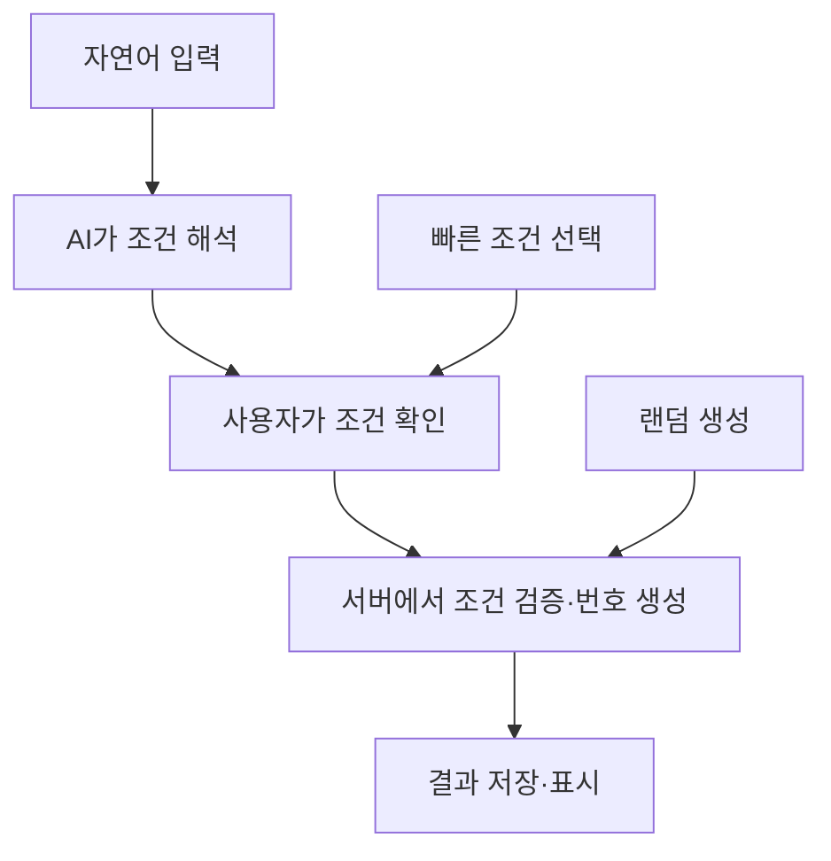

<p align="center">
  
</p>

# CloverPick · 클로버픽

**원하는 조건을 자연어로 입력하면, 그 조건에 맞는 로또·연금복권 번호를 만들어주는 웹 서비스입니다.**

AI와 복권에 대한 관심으로 시작한 개인 프로젝트입니다. 서비스를 직접 운영하면서 데이터 오류를 복구하고, 번호 생성 방식과 화면 사용성을 개선하고 있습니다.

[🍀 서비스 바로가기](https://www.cloverpick.com/)

| 항목 | 내용 |
| --- | --- |
| 개발·운영 기간 | 2024.05 ~ 현재 |
| 담당 범위 | 1인 개발 · 기획, UI/UX 디자인, 프론트엔드·백엔드 개발, 배포·운영 |
| 운영 기록 | GA4 기준 누적 활성 사용자 409명 · 2026.09 기록 |

> AI는 입력한 조건을 해석하는 데 사용합니다. 당첨 번호를 예측하지 않으며, 실제 번호는 서버에서 무작위로 선택합니다. 번호를 생성하거나 복사해도 복권이 구매되지는 않습니다.

## ✨ 어떻게 사용하나요?

로또 또는 연금복권을 선택하고, 한 번에 최대 **5게임**을 만들 수 있습니다. 여기서 1게임은 복권 번호 한 조합을 뜻합니다.

### 세 가지 번호 생성 방식

| 방식 | 사용 방법 |
| --- | --- |
| 랜덤 생성 | 별도 조건 없이 번호를 만듭니다. |
| 빠른 조건 | 서비스에서 미리 제공하는 조건을 버튼으로 선택합니다. |
| 자연어 입력 | 원하는 조건을 문장으로 입력하고, 해석된 내용을 확인한 뒤 번호를 만듭니다. |

자연어 입력 예시:

> “7을 포함하고, 짝수는 3개씩 넣어서 로또 2게임 만들어줘.”

로또에서는 포함·제외할 번호와 홀짝 개수 등을 지정할 수 있습니다. 연금복권에서는 조와 앞자리·뒷자리 숫자를 지정하거나, **동일한 여섯 자리 번호를 1~5조로 한 번에 생성**할 수 있습니다.

### 생성 후에도 확인할 수 있어요

- **생성 목록과 당첨 내역:** 저장된 번호를 살펴보고, 회차별 추첨 결과와 비교합니다. 회차는 한 번의 추첨을 구분하는 번호입니다.
- **모바일 화면과 다크 모드:** 화면 크기와 테마에 맞춰 사용할 수 있습니다.
- **선택형 3D 체험:** 체험 버튼을 누르면 클릭·터치로 번호 공을 움직여볼 수 있습니다.

## 🧩 개발하면서 해결한 문제

### 1. 당첨 결과 수집이 멈춰도, 생성할 번호의 회차는 정확하게

기존에는 데이터베이스에 저장된 마지막 추첨 회차에 1을 더해, 새 번호를 어느 회차에 저장할지 결정했습니다.

당첨 결과 수집이 중단되자 이 값도 갱신되지 않았습니다. 그 결과, 이후 생성한 번호가 잘못된 회차에 저장되고 당첨 결과 비교에서도 누락됐습니다.

**회차 계산과 당첨 결과 수집을 분리했습니다.**

- **날짜로 회차 계산:** 한국 시간과 복권별 판매 마감 시각을 기준으로 계산하도록 바꿨습니다. 수집 데이터가 늦게 들어와도 생성 대상 회차를 결정할 수 있습니다.
- **수집 결과 확인 후 저장:** 엑셀 다운로드 방식에서 최근 회차 조회 API로 전환했습니다. 요청한 회차와 응답에 담긴 회차가 다르면 저장하지 않고, Sentry에 오류를 기록합니다.
- **기존 데이터 복구:** 수정할 대상을 먼저 확인하고 Neon의 복제 데이터베이스에서 검증한 뒤 운영 데이터에 반영했습니다.

| 복구 대상 | 반영 내용 |
| --- | --- |
| 누락된 당첨 결과 | 65회차 추가 저장 |
| 잘못된 회차에 연결된 생성 기록 | 375건의 회차 정정 |
| 누락된 당첨 판별 결과 | 27건 반영 |

관련 코드: [회차 계산](src/utils/calculateRoundNumber.ts) · [수집 결과 검증](src/utils/assertExpectedDrawRound.ts) · [회차 전환 시점 테스트](src/utils/calculateRoundNumber.test.ts)

### 2. AI가 해석한 조건을 확인하고, 서버에서 번호 생성

초기에는 AI가 번호 자체를 선택했습니다. 이후 사용자가 원하는 조건을 확인하고 적용할 수 있도록, **조건 해석과 번호 생성을 나눴습니다.**


```mermaid
flowchart TD
    A["자연어 입력"] --> B["AI가 조건 해석"]
    B --> C["사용자가 조건 확인"]
    D["빠른 조건 선택"] --> C
    C --> E["서버에서 조건 검증·번호 생성"]
    F["랜덤 생성"] --> E
    E --> G["결과 저장·표시"]
```

**AI는 조건을 해석하고, 서버는 규칙을 확인합니다.**

AI SDK로 해석 결과를 정해진 데이터 형식으로 받고, Zod로 형식과 값을 검사합니다. 서버에서는 복권 규칙에 맞는지, 포함·제외 조건이 서로 충돌하지 않는지 확인한 뒤 번호를 생성합니다. 랜덤 생성과 빠른 조건에는 AI를 호출하지 않습니다.

**조건이 좁아도 번호를 반복해서 뽑고 버리지 않도록 했습니다.**

먼저 조건을 만족하는 조합이 몇 개 있는지 계산합니다. 가능한 조합을 순서대로 나열했다고 보고, 서로 다른 위치를 무작위로 선택해 해당 조합을 계산합니다. 모든 조합을 배열로 만들거나, 조건에 맞는 번호가 나올 때까지 무작정 재시도하는 과정을 피했습니다.

연금복권은 `001122`처럼 앞자리의 0과 반복되는 숫자도 의미가 있으므로, 숫자의 순서와 여섯 자리 형식을 보존합니다.

**같은 요청이 다시 들어와도 저장 결과를 중복으로 만들지 않습니다.**

요청마다 고유 식별자를 붙이고, 이미 처리한 요청이면 기존 결과를 반환합니다. 요청 기록과 생성 번호는 하나의 데이터베이스 트랜잭션으로 저장해 함께 성공하거나 함께 취소되도록 했습니다. AI 호출에는 시간 제한과 요청량 제한도 적용했습니다.

관련 코드: [자연어 조건 해석](src/server/lottery/parseLottoPrompt.ts) · [연금복권 생성](src/server/lottery/pensionEngine.ts) · [중복 없는 조합 선택](src/server/lottery/sampleDistinctRanks.ts) · [동시 요청·저장 테스트](src/server/lottery/lottoStorage.integration.test.ts)

### 3. 목록은 끊김 없이 탐색하고, 3D는 원할 때 실행

**페이지를 넘겨도 목록이 갑자기 사라지지 않도록 했습니다.**

다음 페이지를 불러오는 동안 이전 목록을 유지합니다. 또한 처음 조회했을 때의 마지막 기록 ID를 기준으로 조회 범위를 고정했습니다. 탐색 도중 새 기록이 추가돼도 다음 페이지의 항목이 밀리지 않도록 한 방식입니다.

관련 코드: [목록 화면](src/components/lottery/LotteryRecordsList.tsx) · [조회 범위와 페이지 처리](src/server/lottery/lottoRecords.ts)

**3D 체험은 사용자가 선택했을 때만 불러옵니다.**

홈 화면에서 바로 실행하던 3D를 체험 버튼으로 분리했습니다. 화면 밖으로 스크롤하거나 다른 브라우저 탭으로 이동하면 시뮬레이션을 멈추고, 체험을 닫으면 3D 화면을 해제합니다.

관련 코드: [3D 로딩·실행 제어](src/components/home/HomeBallExperience.tsx)

## 🛠️ 기술 구성

| 역할 | 사용 기술 |
| --- | --- |
| 웹 애플리케이션 | Next.js App Router, React, TypeScript |
| 데이터 조회·검증 | TanStack Query, Zod |
| 화면 스타일·애니메이션 | Tailwind CSS, Motion |
| 3D 그래픽·물리 효과 | Three.js, React Three Fiber, @react-three/cannon |
| 서버·데이터베이스 | Next.js Server Actions, PostgreSQL(Neon), Prisma |
| 자연어 조건 해석 | OpenAI API, AI SDK |
| 개발·빌드 | Bun, Turbopack, Biome |
| 테스트·자동 검사 | Vitest, Docker, GitHub Actions |
| 배포·오류 추적·사용 분석 | Vercel, Sentry, GA4 |

## ✅ 검증 방법

번호 생성과 데이터 저장에서 오류가 나기 쉬운 상황을 중심으로 테스트를 구성했습니다.

| 검증 대상 | 확인하는 내용 |
| --- | --- |
| 회차 계산 | 판매 마감 전후처럼 생성 대상 회차가 바뀌는 시점 |
| 번호 생성·당첨 판별 | 복권별 규칙, 입력 조건, 조건 충돌, 당첨 등수 |
| 데이터 저장·동시 요청 | 같은 요청의 중복 저장 방지, 저장 실패 시 취소, 동시 요청 처리 |

계산·생성 로직은 단위 테스트로, 실제 데이터베이스의 저장 동작은 PostgreSQL 통합 테스트로 확인합니다.

[GitHub Actions 설정](.github/workflows/ci.yml)에는 **린트·서식·타입 검사 → 테스트 DB 준비 → 테스트 → 빌드**를 연결했습니다. 로컬 개발과 CI에서는 운영 데이터베이스와 분리된 DB를 사용합니다.

## 🚀 로컬에서 실행하기

### 준비 환경

- Node.js 22.x — 22.12 이상, CI와 동일한 주 버전
- Bun 1.2.23
- Docker 및 Docker Compose — 로컬 PostgreSQL 실행에 사용

### 설치와 실행

```sh
git clone https://github.com/DevMinsuKim/clover-pick.git
cd clover-pick

bun install --frozen-lockfile --ignore-scripts
bun run db:up
bun scripts/with-local-db.mjs run db:prepare:local
bun run dev:local
```

개발 서버가 시작되면 [http://localhost:3000](http://localhost:3000)에서 확인할 수 있습니다.

`db:prepare:local`은 데이터베이스 테이블을 준비하고 Prisma 클라이언트를 생성하는 명령입니다. 앞에 붙인 `with-local-db.mjs`는 이 과정 전체가 Docker의 로컬 DB 주소를 사용하도록 설정합니다.

### AI 기능과 초기 데이터

- **랜덤 생성과 일반 빠른 조건:** OpenAI API 키 없이 사용할 수 있습니다.
- **자연어 조건 해석:** 프로젝트 루트의 `.env`에 `OPENAI_API_KEY`를 설정해야 합니다.
- **과거 당첨 번호의 출현 빈도를 활용하는 조건:** 초기 로컬 DB에는 당첨 이력이 없어 사용할 수 없습니다.

### 검사·테스트·빌드

```sh
bun run check
bun run test:local
bun run build:local
```

`test:local`과 `build:local`도 로컬 DB 설정을 사용합니다. PostgreSQL 통합 테스트를 실행하려면 앞서 안내한 DB 실행과 준비 단계를 완료해야 합니다.
